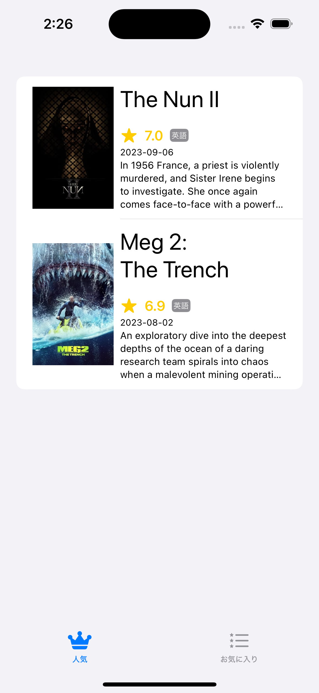

# Day3 宿題

The Movie Database API を利用したアプリを作成してください。要件は以下です。

## 機能要件
- 人気映画一覧画面の表示
  - [MUST] 一覧表示ができている
  - [MUST] サムネイル画像の表示ができている
  - [MUST] リフレッシュができる
  - [OPTION] 追加読み込みができる
- 映画のお気に入り
  - [MUST] ローカルでのお気に入り登録ができている（共通の Token を利用するため、ローカル DB なりへ保存）
- [OPTION] その他、API を使った任意の機能
  - どの API を使っても良いです

## 非機能要件
- [MUST] 外部パッケージを利用している(Swift Package Manager 推奨)
  - 画像の表示の部分で使ってみましょう
- [OPTION] 状態管理方法の設計を工夫
  - 自分で考えて良いように作ってみる、もしくは　MVC/MVVM など調べて導入してみてください。

回答は [Day3Homework](./Day3Homework) を編集して行ってください。

## 補足情報
- 人気映画の判断がどう行われているかなどはこちら
  - https://developer.themoviedb.org/docs/popularity-and-trending
- 画像の URL 組み立て方法はこちら
  - https://developer.themoviedb.org/docs/image-basics
- 人気映画一覧画面の一例
  - 